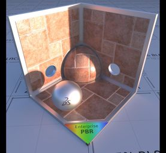
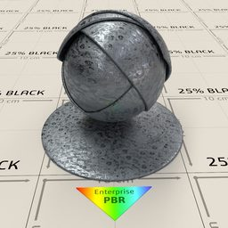
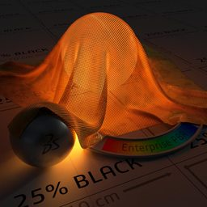

# Enterprise PBR Shading Model

The [Dassault Systèmes](https://www.3ds.com/) Enterprise PBR Shading Model (DSPBR) is an easy-to-use, renderer-independent PBR material for a large variety of industries and use-cases, ranging from high-performance VR applications to high-quality GI renderings.

* [Specification](https://dassaultsystemes-technology.github.io/EnterprisePBRShadingModel/spec.md.html)
* [User Guide](https://dassaultsystemes-technology.github.io/EnterprisePBRShadingModel/user_guide.md.html)

## License

Enterprise PBR Shading Model (c) Dassault Systèmes 2019

Enterprise PBR Shading Model (DSPBR) licensed under a [Creative Commons Attribution-ShareAlike 4.0 International License](https://creativecommons.org/licenses/by-sa/4.0/).

In addition, please acknowledge your use of the Dassault Systèmes Enterprise PBR Shading Model (DSPBR) when DSPBR is used or implemented in a product by adding  the following "[name of the product] is implementing DSPBR, the Dassault Systèmes Enterprise PBR Shading Model", in a place and format which shall be reasonably visible. 
