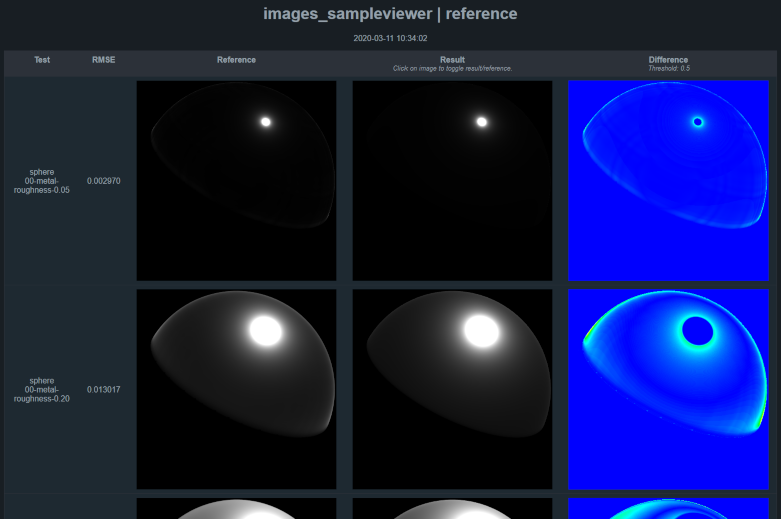

# Enterprise PBR Validation Suite

The Enterprise PBR Validation Suite consists of reference images and scripts to compare results rendered in various rendering engines against the ground-truth. The scenes are provided as glTF files with custom extensions for parameters not supported by the glTF metallic-roughness material.

## Usage

Validation is a two-step process: rendering the scenes and comparing the resulting images against the reference images. We provide a Python script for rendering the test scenes with the [glTF 2.0 sample viewer](https://github.com/KhronosGroup/glTF-Sample-Viewer) and a skeleton that can be used as a starting point for custom renderers.

### Setup

The Python scripts require [Pillow](https://pillow.readthedocs.io/en/stable/]), [imageio](https://imageio.readthedocs.io/en/stable/) (with [Freeimage binary](https://imageio.readthedocs.io/en/stable/format_exr-fi.html#exr-fi-ilm-openexr)) and [Jinja2](https://palletsprojects.com/p/jinja/). Install the libraries with the following commands:

```
pip install Pillow
pip install jinja2
pip install imageio
imageio_download_bin freeimage
```

### Rendering with the glTF 2.0 Sample Viewer

The following command renders all glTF files with the glTF 2.0 sample viewer and places the output into `images_sampleviewer/`.

```
render_sampleviewer.py -o images_sampleviewer path/to/sampleviewer
```

As there is no command line option to disable IBL and enable point lights in the sample viewer, you have to add the following lines to `headless.html` below `viewer.renderingParameters.cameraIndex =...`:

```
viewer.renderingParameters.useIBL = false;
viewer.renderingParameters.usePunctual = true;
viewer.renderingParameters.clearColor = [0, 0, 0];
```

In addition, make sure the light intensity is divided by 4*pi in `toUniform()` in `src/lights.js`:

```
uLight.range = this.range;
uLight.color = jsToGl(this.color);
uLight.intensity = this.intensity / (4.0 * Math.PI);
```

Afterwards, run `npm run build` to rebuild to sample viewer.

### Custom Renderers

Edit the `render_custom.py` script so that it outputs the images into the appropriate directory. Make sure that the images have a size of 400x400 pixels and 3 color channels (RGB). High-dynamic range images in EXR format are preferred, but PNG is also supported. Note that for PNG a custom tone-mapper has to be implemented, as the reference images are provided only as EXR files.

### Validation

The script `validate.py` will produce a HTML report with side-by-side comparison of reference and result image, as well as a heatmap to visualize the difference. The following command will compare the images stored in directory `images_sampleviewer/` against the reference images in `reference/` with a threshold of 0.5, and store the result in `reports/sampleviewer/`. As the glTF sample viewer cannot produce HDR images, we have to tone-map the reference images before comparison with a compatible tone-mapper, `only_gamma` in this case.

```
validate.py -i images_sampleviewer -m only_gamma -t 0.5 -o report/sampleviewer
```

Open `reports/sampleviewer/index.html` to view the results.



### Custom Tone-Mappers

If a renderer is not able to create HDR images, the reference images have to be tone-mapped before comparison. It is important to use exactly the same tone-mapping as the rendering engine, otherwise the results are invalid.

Custom tone-mappers can be added by adding a Python script prefixed with `tonemap_`, see `tonemap_simple.py` or `tonemap_only_gamma.py` as an example. The tone-mapper can be selected with the `-m` (`--tonemapper`) parameter in `validate.py`.
